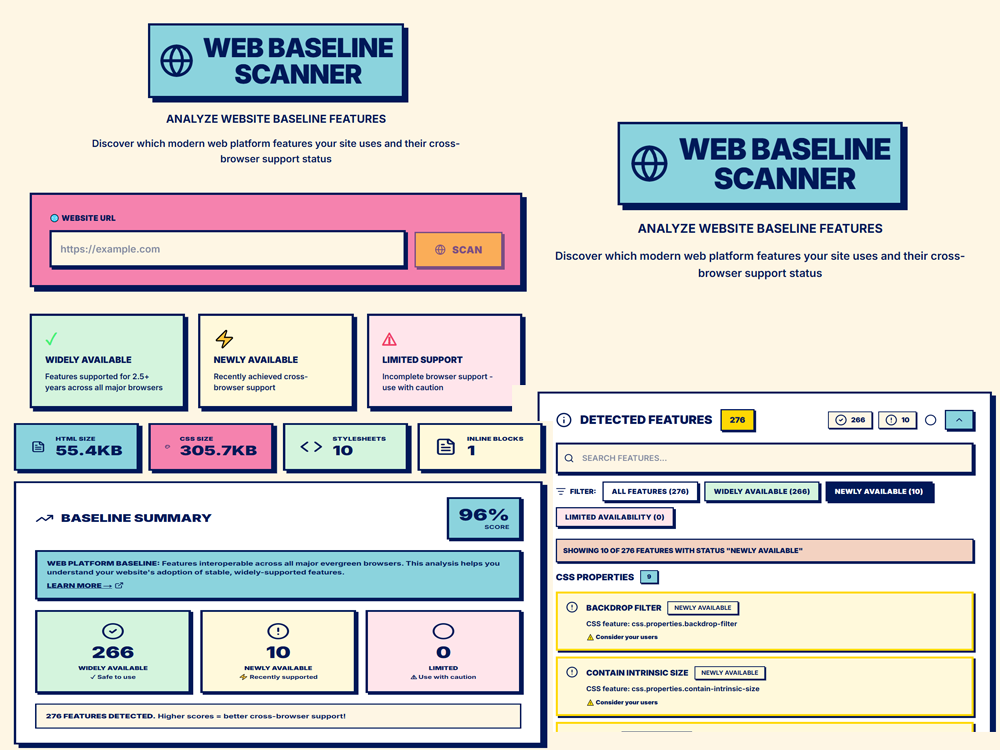

<h1 align="center">
  <br>
  <a href=""></a>
  <br>
  Web Baseline Scanner
  <br>
</h1>

<h4 align="center">A Next.js application that scans websites to detect and analyze their usage of modern web platform features based on the [Web Platform Baseline](https://web.dev/baseline) standard.</h4>


## What It Does

This tool scans any public website and:
- Extracts HTML and CSS content
- Identifies which modern web features are being used
- Checks each feature's browser compatibility status using the Baseline standard
- Categorizes features as:
  - **Widely Available**: Supported everywhere for 2.5+ years
  - **Newly Available**: Recently achieved cross-browser support
  - **Limited Availability**: Not yet supported in all major browsers
- Provides a compatibility score and implementation guidance

## How It Works

### Scanning Process

1. **Content Extraction**: Fetches the target website's HTML and parses it with Cheerio
2. **CSS Collection**: Extracts CSS from `<style>` tags and external stylesheets
3. **Feature Detection**: 
   - Parses HTML elements and attributes
   - Parses CSS using css-tree to detect properties, selectors, and at-rules
   - Matches detected features against [@mdn/browser-compat-data](https://github.com/mdn/browser-compat-data)
4. **Baseline Status**: Uses [compute-baseline](https://github.com/web-platform-dx/compute-baseline) to determine each feature's compatibility status
5. **Highlighting**: Adds visual indicators to the rendered page preview showing baseline status

### Technical Stack

- **Framework**: Next.js 15 with App Router
- **Parsing**: 
  - `cheerio` for HTML parsing
  - `css-tree` for CSS parsing
- **Baseline Data**:
  - `web-features` - Catalog of web platform features
  - `@mdn/browser-compat-data` - Browser compatibility data
  - `compute-baseline` - Baseline status calculator
- **Styling**: Tailwind CSS with neobrutalism aesthetic
- **Code Highlighting**: @wooorm/starry-night

## Installation

### Prerequisites
- Node.js 18.17 or later
- npm, yarn, pnpm, or bun

### Setup

1. Clone the repository:
```bash
git clone https://github.com/malawadd/baseline.git
cd baseline
```

2. Install dependencies:
```bash
npm install
```

3. Run development server:
```bash
npm run dev
```

4. Open [http://localhost:3000](http://localhost:3000)

### Build for Production

```bash
npm run build
npm start
```

## Project Structure

```
src/
├── app/
│   ├── page.tsx                    # Homepage with URL input
│   ├── scan/[url]/page.tsx         # Scan results page
│   └── api/scan/route.ts           # Backend scanning API
├── components/
│   ├── UrlScanInput.tsx            # URL input form
│   ├── BaselineSummaryCard.tsx     # Compatibility score display
│   ├── BaselineFeaturesDisplay.tsx # Feature list with filters
│   ├── HighlightedHtmlDisplay.tsx  # Rendered preview with highlights
│   ├── FeatureDetailModal.tsx      # Feature detail popup
│   └── ScanResultsDisplay.tsx      # Main results container
├── lib/
│   ├── baselineDetector.ts         # Feature detection logic
│   ├── htmlHighlighter.ts          # Adds baseline highlights to HTML
│   └── baselineSummary.ts          # Calculates compatibility metrics
├── hooks/
│   └── useScanData.ts              # Data fetching hook
└── types/
    └── index.ts                    # TypeScript definitions
```

## API

### `POST /api/scan`

Scans a website and returns baseline feature analysis.

**Request:**
```json
{
  "url": "https://example.com"
}
```

**Response:**
```json
{
  "url": "https://example.com",
  "htmlContent": "<!DOCTYPE html>...",
  "cssContent": "body { margin: 0; }...",
  "htmlLength": 2048,
  "cssLength": 512,
  "stylesheets": 2,
  "inlineBlocks": 1,
  "baselineFeatures": [...],
  "baselineSummary": {
    "widelyAvailable": 45,
    "newlyAvailable": 12,
    "limitedAvailability": 3,
    "total": 60
  },
  "highlightedHtmlContent": "...",
  "snippet": "..."
}
```

## Features

- **Feature Detection**: Automatically detects HTML elements, CSS properties, selectors, and at-rules
- **Baseline Status**: Shows compatibility across major browsers (Chrome, Edge, Firefox, Safari)
- **Visual Highlights**: Color-coded indicators in the page preview
- **Search & Filter**: Find specific features by name or status
- **Implementation Guidance**: Get recommendations for each feature
- **Documentation Links**: Quick access to MDN, Can I Use, and web.dev
- **Code Viewer**: Syntax-highlighted HTML and CSS source with annotations

## Limitations

- **CORS**: Some websites block cross-origin requests
- **Static Analysis Only**: Does not execute JavaScript or analyze dynamic content
- **No Authentication**: Cannot scan sites requiring login
- **Large Sites**: May timeout or use significant memory on very large websites
- **CSS-in-JS**: Does not detect features in JavaScript-generated styles

## Deployment

This project works best on platforms with full Node.js runtime support:
- **Railway** (recommended)
- **Render**
- **Fly.io**
- **DigitalOcean App Platform**

Note: Vercel may have issues with the `css-tree` dependency due to serverless limitations.

## About Baseline

[Web Platform Baseline](https://web.dev/baseline) is a unified view of what's ready to use in your website or web app. A feature is in Baseline when it's supported in the current and previous version of all major browsers (Chrome, Edge, Firefox, Safari).

